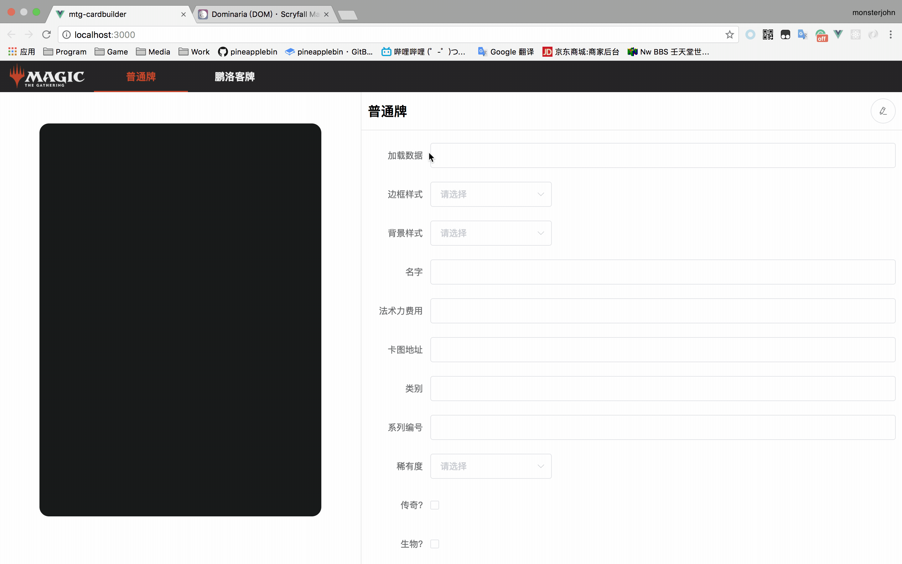

# MTGCardBuilder

<!--  -->


基于vue制作的MTG卡牌生成器，可以通过填写各项参数来渲染出卡片效果。  
样式非完全依照实体卡样式，而是参考了MTGA内的卡牌样式。

## 运行步骤

``` bash
npm install
# 启动测试服务，访问localhost:8080
npm run dev
```

## 已实现模版

- [x] 正常模版
- [x] 鹏洛客模版
- [x] 衍生物模版
- [x] 双面牌模版
- [x] 依夏兰双面地模版
- [x] 升级异能模版(Level up)
- [x] 分裂牌模版(包括余响模版、神河颠倒模版)

## 后续更新功能

- [ ] 异能效果完整
- [ ] 效果栏图标完整
- [ ] 鸡飞模版
- [ ] DOM更新的样式 *2018.04*
